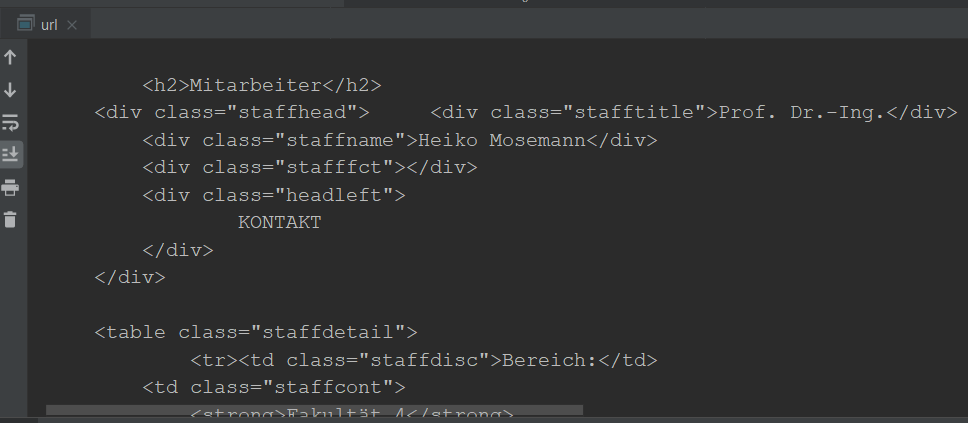
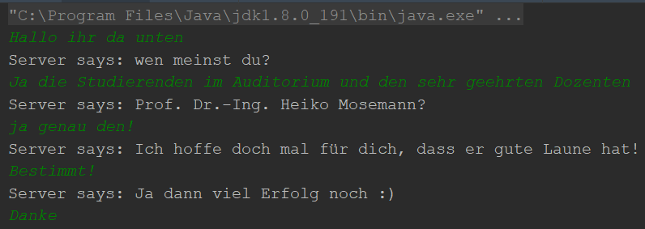

Netzwerkprogrammierung
===

# 

##### Patrick Szalewicz

###### Hochschule Bremen - Prog2 (Prof. Dr.-Ing. Heiko Mosemann)

---

<!--
page_number: true
$size: 16:9
template: invert
footer: Netzwerkprogrammierung - Patrick Szalewicz
-->

# Agenda

- LAN / WAN
- IP-Adressen
- Ports
- Server
- Proxy
- Netzwerke in Java
- URL-Objekte
- Daten von URL lesen
- Sockets

---

# LAN / WAN

Abhängig von den zu überbrückenden Entfernungen teilt man Netzwerke in zwei Gruppen ein:

- **LAN** (local area network): 
Hiermit wird ein Netz bezeichnet, dessen Reichweite auf wenige Gebäude eines abgeschlossenen Geländes (Betrieb, Fach- oder Hochschule, Verwaltung, Schule, ...) beschränkt ist.

- **WAN** (wide area network): 
Dieses Netz verbindet Teilnehmer über Hunderte von Kilometern, beispielsweise auch via Satellit (Internet).


---

# IP-Adressen

- Jeder Rechner ist im Internet durch eine Adresse identifiziert.
Man nennt diese IP-Adresse.

- IP Adressen sind nicht leicht zu merken. Daher stehen stellvertretend für Adressen einfache Namen.

- Ein spezieller Dienst wandelt den Namen in eine IP-Adresse um.

- Dieser Dienst ist der Namensdienst und wird von einem DNS-Server übernommen.


---

# IP-Adressen

> Welche IP-Adressen kennt ihr?

---

# IP-Adressen

| IP | Host |
| ------------- |:-------------:|
| 1.1.1.1 | Cloudflare DNS |
| 8.8.8.8 | Google DNS |
| 194.94.24.5 | hochschule-bremen.de |
| 192.109.135.50 | hs-bremerhaven.de |
| 85.13.155.63 | die-partei.de |
| 185.230.162.140 | fachinformatiker.app |

---

# Ports

- Für jeden Dienst (Service), den ein Server zur Verfügung stellt, gibt es einen Port.

- Alltagsbeispiel: Es reicht nicht aus, die Adresse der Verwaltung in der Stadt zu kennen. Ich brauche auch noch eine Zimmernummer.

- IP-Adressen und Ports werden nicht willkürlich, sondern von der IANA (Internet Assigned Numbers Authority) vergeben.

- Die Portnummer ist eine 16 Bit Zahl, eingeteilt in:
  - System 0-1023 (›Well-Known‹, Contact) und
  - Benutzer 1024-65535.

- Komplette Liste ist einsehbar unter: https://www.iana.org/assignments/service-names-port-numbers/service-names-port-numbers.xhtml

---

# Ports

> Was für Ports kennt ihr?

---

# Ports

| Port | Dienst |
| ------------- |:-------------:|
| 9 | Wake-on-LAN |
| 21 | FTP |
| 22 | SSH |
| 23 | Telnet |
| 25 | SMTP |
| 69 | TFTP |
| 80 | HTTP |
| 88 | Kerberos |

---

# Ports

| Port | Dienst |
| ------------- |:-------------:|
| 110 | POP3 |
| 123 | NTP |
| 143 | IMAP |
| 161 | SNMP |
| 443 | HTTPS |
| 666 | Doom |
| 666 | aircrack-ng server |

---

# Server

> Was für Server (Dienste) kennt ihr?

---

# Server

| Server        | Nutzen           |
| ------------- |:-------------:|
| Web-Server | Server, der HTML-Dokumente und andere Internet-Ressourcen speichert und versendet bzw. entgegennimmt |
| FTP-Server | Liefert Dateien, Programme, Daten  oder nimmt sie an, allerdings nicht so komfortabel wie bei www. |
| Mail-Server | Speichert ankommende E-Mail und liefert sie aus |
| Proxy-Server | Speichert Kopien aufgerufener Webseiten. Beim wiederholtem Aufruf wird dem Benutzer eine Kopie zugesandt. Damit kann Netzkapazität gespart werden. |
| File-Server | Stellt seinen Clients Dateien und Speicherplatz bereit und übernimmt die Sicherung der Benutzerdateien. |

---

# Proxy

Der Internetverkehr größerer Firmen geht in der Regel durch einen Proxy.

Ein Proxy-Server lässt sich ich Java durch spezielle Property-Variablen zuweisen:

```java
System.setProperty( "proxySet", "true" );
System.setProperty( "proxyHost", "proxy.murdr.eu" );
System.setProperty( "proxyPort", "81" );
```
---

# Netzwerke in Java

- Das Entwurfsziel von Java war: Einfache Verbindung zwischen Rechnern und SetBox-Systemen.

- Das Standardpaket java.net hilft bei allen Netzwerkverbindungen.

- Mit Datenströmen wird das Lesen/Schreiben so leicht wie der Zugriff auf das Dateisystem.

- Verbindung zu Servern und Abrufen von Daten mit gewöhnlichen Web-Protokollen und Sockets.

---

# Netzwerke in Java

- Den Umgang mit IP-Adressen übernimmt eine Java-Klasse java.net.InetAddress

- Die Klasse InetAddress hat keine öffentlichen Konstrukturen, nur einige statische Methoden

- InetAddress.getLocalHost() liefert die IP-Adresse des lokalen Rechners, oft (127.0.0.1)

- InetAddress.getByName(String host) liefert die IP-Addresse eines gegebenen Hosts.

- Der Parameter host ist entweder der Maschinenname (»fachinformatiker.app«) oder eine String-Repräsentation der IP-Adresse (»185.230.162.140«).

- Kann die IP-Adresse nicht gefunden werden, so lösen die Methoden eine UnknownHostException aus.

---

# Netzwerke in Java

Die Objektmethoden stellen Anfragen an das InetAddress-Objekt:

- byte[] getAddress()
Liefert die IP-Adresse als Bytefeld.

- String getHostAddress()
Liefert einen String in der Form A.B.C.D

- String getHostName()
Liefert den Hostnamen für die Adresse.

---

# URL-Objekte

URL-Objekte repräsentieren Hostnamen, Port und Dateiname.

Die Konstruktoren lösen eine MalformedURLException aus, wenn:
- der Parameter im Konstruktor null ist oder
- das URL-Objekt ein unbekanntes Protokoll beschreibt.

---

# Daten von URL lesen

```java
String s = "https://www.hs-bremen.de/internet/de/hsb/struktur/mitarbeiter/hmosemann/";
URL url = new URL(s);

BufferedReader reader = new BufferedReader(new InputStreamReader(url.openStream()));

String line;

while ((line = reader.readLine()) != null) {
	System.out.println(line);
}

reader.close();
```

---

# Daten von URL lesen

# 

---

# Sockets

- URL-Verbindungen sind schon High-Level Verbindungen.

- Die Rechner, die im Internet verbunden sind, kommunizieren über Protokolle (bsp. TCP/IP).

- Ein Socket dient zur Abstraktion und ist ein Verbindungspunkt in einem TCP/IP Netzwerk.

---

# Sockets

- Wer Daten empfängt (Client) öffnet eine Socket-Verbindung zum Horchen 

- Derjenige der sendet, öffnet eine Verbindung zum Senden (Server)

- Mit einem Socket baut man eine feste Verbindung zu einem Rechner auf, die für die Dauer der Übertragung bestehen bleibt.
- Was für den Server Ausgabe-/Eingabestrom ist, ist für den Client Eingabe-/Ausgabstrom.

---

# Sockets

- Auf der Client-Seite bauen wir zuerst ein Socket-Objekt auf.

- Der Server soll auf Port 80 kontaktiert werden.

```java
Socket clientSock;
clientSock = new Socket( "die.weite.welt", 80 );
```
- Die Klasse Socket bietet die Methoden getInputStream() und getOutputStream(), die einen Zugang zum Datenstrom erlauben.
- Um die Performanz zu heben, können wir einen gepufferten OutputSteam nutzen:

```java
InputStream is = server.getInputStream();
BufferedReader in;
in = new BufferedReader( new InputStreamReader(is) );
```

---

# Sockets

```java
Socket s = new Socket( "www.die-partei.de", 80 );
out.println( s.getKeepAlive() );           // false
out.println( s.getLocalAddress() );        // /195.37.111.215
out.println( s.getLocalPort() );           // 56339
out.println( s.getLocalSocketAddress() );  // /195.37.111.215:56339
out.println( s.getOOBInline() );           // false
out.println( s.getPort() );                // 80
out.println( s.getRemoteSocketAddress() ); // www.die-partei.de/85.13.155.63:80
out.println( s.getReuseAddress() );        // false
out.println( s.getReceiveBufferSize() );   // 65536
out.println( s.getSendBufferSize() );      // 65536
out.println( s.getSoLinger() );            // –1
out.println( s.getTcpNoDelay() );          // false
out.println( s.getTrafficClass() );        // 0
```

---

# Die 6 Schritte einer Verbindung

1. Ein Server-Socket erzeugen der horcht

2. Mit der accept()-Methode auf neue Verbindungen warten

3. Ein- und Ausgabestrom vom zurückgegebenen Socket erzeugen

4. Mit einem definierten Protokoll die Konversation unterhalten

5. Stream vom Client und Socket schließen

6. Bei Schritt 2 weitermachen oder Server-Socket schließen

---

# Server

```java
ServerSocket ss = new ServerSocket(1337);
Socket s = ss.accept();
DataInputStream din = new DataInputStream(s.getInputStream());
DataOutputStream dout = new DataOutputStream(s.getOutputStream());
BufferedReader br = new BufferedReader(new InputStreamReader(System.in));

String str = "";
String str2 = "";
while(!str.equals("stop")){
    str = din.readUTF();
    System.out.println("client says: "+str);
    str2 = br.readLine();
    dout.writeUTF(str2);
    dout.flush();
}
din.close();
s.close();
ss.close();
}
```

---

# Client

```java
Socket s = new Socket("localhost",1337);
DataInputStream din = new DataInputStream(s.getInputStream());
DataOutputStream dout = new DataOutputStream(s.getOutputStream());
BufferedReader br = new BufferedReader(new InputStreamReader(System.in));

String str = "";
String str2 = "";
while(!str.equals("stop")){
    str = br.readLine();
    dout.writeUTF(str);
    dout.flush();
    str2 = din.readUTF();
    System.out.println("Server says: "+str2);
}

dout.close();
s.close();
```

---

# Client und Server als kleine Chat-Applikation

# 

---

# Quellen

Java ist auch eine Insel (Christian Ullenboom)
http://openbook.rheinwerk-verlag.de/javainsel/

C von A bis Z (Jürgen Wolf)
http://openbook.rheinwerk-verlag.de/c_von_a_bis_z/025_c_netzwerkprogrammierung_001.htm

Netzwerk-Programmierung
http://www.netzmafia.de/skripten/inetprog/index.html

---

## Vielen Dank für eure Aufmerksamkeit :+1:


<!--
footer: Die Präsentation wurde mit Markdown erstellt :P
-->
<br />
<br />
<br />
<br />

Die Folien und alle Codebeispiele findet ihr unter:
### https://github.com/fachinformatiker/Vortrag_Netzwerk

